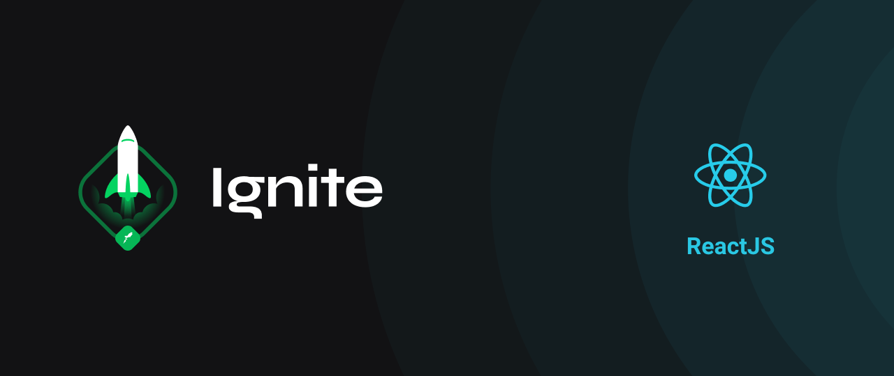
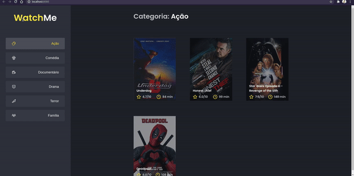

<div align="center" id="top"> 
  

  &#xa0;

  <!-- <a href="https://01githubexplorer.netlify.com">Demo</a> -->
</div>

<h1 align="center">WatchME - Componetizando uma aplicação</h1>

<p align="center">
  

 

  <!--  -->

  <!--  -->

  <!--  -->


</p>
<p align="center">
  <a href="#dart-sobre-o-desafio">Sobre</a> &#xa0; | &#xa0; 
   <a href="#rocket-tecnologias">Tecnologias</a> &#xa0; | &#xa0;
  <a href="#white_check_mark-pré-requesitos">Pré requisitos</a> &#xa0; | &#xa0;
  <a href="#checkered_flag-começando">Começando</a> &#xa0; | &#xa0;
  <a href="#thinking-como-contribuir">Como contribuir</a> &#xa0; | &#xa0;
  <a href="#memo-licença">Licença</a> &#xa0; | &#xa0;
  <a href="https://github.com/thiilins" target="_blank">Autor</a>
</p>
 
 &#xa0;

 <p align="center">
 
 </p>
<br>


## :dart: Sobre o desafio ##

Desafio 2 do módulo 1 da trilha de ReactJS da Rocketseat, essa será uma aplicação onde o seu principal objetivo é refatorar uma página para listagem de filmes de acordo com gênero. 

A aplicação já está totalmente funcional mas grande parte do seu código está diretamente no arquivo `App.tsx`. Para resolver isso da melhor forma, é necessário dividir a aplicação em **pelo menos** duas partes principais: sidebar e o conteúdo principal que possui o header e a listagem de filmes.

- A aplicação possui apenas uma funcionalidade principal que é a listagem de filmes;
- Na sidebar é possível selecionar qual categoria de filmes deve ser listada;
- A primeira categoria da lista (que é "Ação") já deve começar como marcada;
- O header da aplicação possui apenas o nome da categoria selecionada que deve mudar dinamicamente.

 &#xa0;

## :rocket: Tecnologias ##

As seguintes ferramentas foram usadas na construção do projeto:

- [Expo](https://expo.io/)
- [Node.js](https://nodejs.org/en/)
- [React](https://pt-br.reactjs.org/)
- [TypeScript](https://www.typescriptlang.org/)

 &#xa0;
 
## :white_check_mark: Pré requisitos ##

Antes de começar :checkered_flag:, você precisa ter o [Git](https://git-scm.com) e o [Node](https://nodejs.org/en/) instalados em sua maquina.

 &#xa0;

## :checkered_flag: Começando ##

```bash
# Clone este repositório
$ git clone https://github.com/thiilins/componentizando-uma-aplicacao

# Entre na pasta
$ cd componentizando-uma-aplicacao

# Instale as dependências
$ yarn

# Para iniciar o projeto
$ yarn start

# O app vai inicializar em <http://localhost:3000>
```
 &#xa0;

## :thinking: Como contribuir

- Faça um fork desse repositório;
- Cria uma branch com a sua feature: `git checkout -b minha-feature`;
- Faça commit das suas alterações: `git commit -m 'feat: Minha nova feature'`;
- Faça push para a sua branch: `git push origin minha-feature`.

Depois que o merge da sua pull request for feito, você pode deletar a sua branch.

 &#xa0;

## :memo: Licença ##

Este projeto está sob licença MIT. Veja o arquivo [LICENSE](LICENSE.md) para mais detalhes.

 &#xa0;

Feito com :heart: por <a href="https://github.com/thiilins" target="_blank">Thiago Lins</a>

&#xa0;


<p align="right">(<a href="#top">Voltar para o topo</a>)</p>
